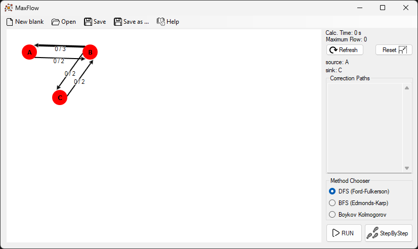

# MaxFlow
Software for visualization of maximum flow algorithms!  
Szoftver maximális folyamkereső algoritmusok vizualizációjára!

The program provides an interface for the user to create flow networks. The prepared graphs can be saved to the disc as files for later use. The saved graphs can be loaded. The software can run maximum flow simulations on the graphs using Ford-Fulkerson, Edmonds-Karp and Boykov-Kolmogorov algorithms. The user can run the entire simulation at once, or step by step. The user can learn how these algorithms work by using this software, or the user can use the software to calculate maximum flow with illustrations

A program egy felületet biztosít, amin a felhasználó képes hálózati gráfokat létrehozni. Az elkészített gráfokat fájlba lehet menteni, hogy később újra be lehessen őket olvasni. A felületen elkészített gráfokon maximális folyam szimulációt lehet futtatni Ford-Fulkerson, Edmonds-Karp és Boykov-Kolmogorov algoritmusokkal. Ezt a felhasználó megteheti egyszerre, vagy lépésenként is. A felhasználó a szoftver használatának segítségével megismerkedhet az imént említett algoritmusok működésével, vagy kiszámolhatja vele a gráfok maximális folyamának értékét illusztrációval.

